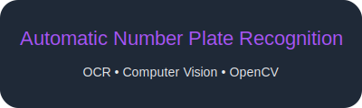

<p align="center">
  <a href="https://github.com/SAUNAK-RAMIYA-SEBASAN/Automatic-Number-Plate-Recognition">
    
  </a>
</p>

<h2 align="center">Automatic Number Plate Recognition (ANPR)</h2>

<div align="center">

  OCR • Computer Vision • OpenCV

</div>


<div align="center">

[](https://www.python.org/)
[](https://opencv.org/)
[](https://github.com/tesseract-ocr/tesseract)
[](https://streamlit.io/)
[](LICENSE)
[](https://docs.astral.sh/uv/)

</div>

A production-ready Automatic Number Plate Recognition pipeline built with Python, OpenCV, and Tesseract OCR. Features a modular architecture with contour-based plate detection, robust OCR extraction, and an interactive Streamlit web interface.

---

## Table of Contents

- [Features](#features)
- [Tech Stack](#tech-stack)
- [Prerequisites](#prerequisites)
- [Installation](#installation)
- [Pipeline Architecture](#pipeline-architecture)
- [Usage](#usage)
- [Project Structure](#project-structure)
- [Configuration](#configuration)
- [Troubleshooting](#troubleshooting)

---

## Features

- **Dataset Integration**: Automatic download from [Hugging Face Datasets](https://huggingface.co/datasets/ud-smart-city/license-plate-dataset)
- **Contour-Based Detection**: Multi-stage filtering using MSER and geometric analysis
- **Robust OCR**: Tesseract-powered text extraction with post-processing
- **Interactive UI**: Streamlit-based web interface for real-time processing
- **Modular Design**: Clean separation of concerns for easy extension

---

## Tech Stack

| Component | Technology | Purpose |
|-----------|------------|---------|
| Language | [Python 3.10+](https://www.python.org/) | Core runtime |
| Package Manager | [uv](https://docs.astral.sh/uv/) | Fast dependency management |
| Image Processing | [OpenCV](https://opencv.org/) | Computer vision operations |
| OCR Engine | [Tesseract](https://github.com/tesseract-ocr/tesseract) | Text recognition |
| Python OCR | [pytesseract](https://github.com/madmaze/pytesseract) | Python Tesseract bindings |
| Dataset | [Hugging Face Datasets](https://huggingface.co/docs/datasets/) | Dataset loading |
| Web UI | [Streamlit](https://streamlit.io/) | Interactive interface |

---

## Prerequisites

### Required Software

1. **Python 3.10 or higher**
   - Download from [python.org](https://www.python.org/downloads/)
   - Verify: `python --version`

2. **uv** (Python package manager)
   - Installation guide: [docs.astral.sh/uv/getting-started/installation](https://docs.astral.sh/uv/getting-started/installation/)
   - Quick install: `curl -LsSf https://astral.sh/uv/install.sh | sh` (Unix) or `powershell -c "irm https://astral.sh/uv/install.ps1 | iex"` (Windows)

3. **Tesseract OCR**
   - **Ubuntu/Debian**: `sudo apt-get install tesseract-ocr`
   - **macOS**: `brew install tesseract`
   - **Windows**: Download from [UB Mannheim](https://github.com/UB-Mannheim/tesseract/wiki)
   - Verify: `tesseract --version`

4. **Git** (for cloning)
   - Download from [git-scm.com](https://git-scm.com/downloads)

---

## Installation

### 1. Clone the Repository

```bash
git clone https://github.com/SAUNAK-RAMIYA-SEBASAN/Automatic-Number-Plate-Recognition
cd number-plate-detection
```

### 2. Create Virtual Environment

```bash
# Using uv (recommended)
uv venv

# Or using standard venv
python -m venv .venv
```

### 3. Install Dependencies

```bash
# Using uv (recommended)
uv sync

# Or using pip
pip install -r requirements.txt
```

### 4. Configure Tesseract Path (Windows only)

If Tesseract is not in your system PATH, create a `.env` file:

```env
# Windows example - adjust path to your installation
TESSERACT_CMD=C:\Program Files\Tesseract-OCR\tesseract.exe
```

---

## Pipeline Architecture

```
┌─────────────────────────────────────────────────────────────────┐
│                    ANPR Pipeline Flow                           │
└─────────────────────────────────────────────────────────────────┘

┌──────────────┐    ┌──────────────┐    ┌──────────────┐
│   Dataset    │──▶│  Preprocess  │───▶│   Detect     │
│   Loader     │    │    Image     │    │    Plate     │
└──────────────┘    └──────────────┘    └──────────────┘
                                              │
                                              ▼
┌──────────────┐    ┌──────────────┐    ┌──────────────┐
│   Cleaned    │◀───│     OCR      │◀──│   Extract    │
│    Text      │    │  Extraction  │    │     ROI      │
└──────────────┘    └──────────────┘    └──────────────┘
```

### Module Descriptions

| File | Purpose | Key Functions |
|------|---------|---------------|
| [`src/dataset_loader.py`](src/dataset_loader.py) | Downloads and caches the license plate dataset from Hugging Face | `load_and_save_dataset()` |
| [`src/preprocessing.py`](src/preprocessing.py) | Image preprocessing for optimal detection (grayscale, Gaussian blur) | `preprocess_image()`, `preprocess_all_images()` |
| [`src/plate_detection.py`](src/plate_detection.py) | Detects license plate regions using MSER + contour filtering | `detect_plate()`, `filter_contours()` |
| [`src/ocr.py`](src/ocr.py) | Extracts text from detected plates using Tesseract | `extract_text()`, `clean_plate_text()` |
| [`src/main.py`](src/main.py) | Pipeline orchestrator for testing and batch processing | `run_pipeline()`, `process_single_image()` |
| [`app.py`](app.py) | Streamlit web interface for interactive use | Interactive UI components |

### Detection Strategy

1. **Canny Edge Detection**: Detects edges in the preprocessed grayscale image
2. **Contour Finding**: Extracts contours from the edge map using `cv2.findContours`
3. **Geometric Filtering**: Validates plate candidates by:
   - 4-sided polygon approximation
   - Aspect ratio between 2:1 and 5:1
   - Minimum area threshold (500 pixels)
4. **Perspective Transform**: Crops and warps the detected plate to a rectangular view

### OCR Post-Processing

- Uppercase alphanumeric normalization
- Whitespace removal
- Tesseract PSM 7 (single text line) mode for focused recognition

---

## Usage

### Run Pipeline Test (Command Line)

```bash
# Process a batch of images
uv run src/main.py

# Or with standard Python
python src/main.py
```

### Launch Web Interface

```bash
# Start Streamlit app
uv run streamlit run app.py

# Or
streamlit run app.py
```

Then open your browser to `http://localhost:8501`

### Using the Web Interface

1. Upload an image containing a vehicle license plate (JPG, JPEG, or PNG)
2. View the original and detected plate region side-by-side
3. See the extracted license plate text displayed

---

## Project Structure

```
number-plate-detection/
│
├── dataset/                    # Data storage
│   └── raw/                    # Downloaded images from Hugging Face
│
├── src/                        # Source code
│   ├── dataset/                # Dataset processing
│   │   ├── raw/                # Raw images
│   │   ├── processed/          # Preprocessed images (grayscale, blurred)
│   │   └── detected/           # Cropped license plate regions
│   ├── dataset_loader.py       # Hugging Face dataset integration
│   ├── preprocessing.py        # Image preprocessing utilities
│   ├── plate_detection.py      # License plate detection logic
│   ├── ocr.py                  # OCR text extraction
│   └── main.py                 # Pipeline test runner
│
├── test/                       # Test images
├── app.py                      # Streamlit web application
├── pyproject.toml              # Project configuration (uv)
├── requirements.txt            # Python dependencies
├── .python-version             # Python version specification
├── .gitignore                  # Git ignore patterns
└── README.md                   # This file
```

---

## Configuration

### Environment Variables

Create a `.env` file in the project root:

```env
# Hugging Face token (required for dataset download)
HF_TOKEN=your_huggingface_token_here

# Tesseract OCR path (Windows - adjust to your installation)
TESSERACT_CMD=C:\Program Files\Tesseract-OCR\tesseract.exe
```

### Pipeline Parameters

Edit hardcoded parameters in [`src/plate_detection.py`](src/plate_detection.py):

```python
# In filter_plate_contour() function:
aspect_ratio = w / float(h)
if not (2.0 <= aspect_ratio <= 5.0):  # Aspect ratio constraints
    return False

min_area = 500  # Minimum contour area in pixels (filters noise)
```

---

## Troubleshooting

### Tesseract Not Found

**Error**: `TesseractNotFoundError`

**Solution**:
1. Install Tesseract (see [Prerequisites](#prerequisites))
2. Add to PATH or set `TESSERACT_CMD` in `.env`
3. Verify: `tesseract --version`

### OpenCV Import Error

**Error**: `ImportError: No module named 'cv2'`

**Solution**:
```bash
# Reinstall with headless support
uv pip install opencv-contrib-python
```

### Dataset Download Fails

**Error**: `ConnectionError`, timeout, or "HF_TOKEN not found"

**Solution**:
1. Create a `.env` file with your Hugging Face token: `HF_TOKEN=your_token_here`
2. Get your token from [huggingface.co/settings/tokens](https://huggingface.co/settings/tokens)
3. Check internet connection
4. Verify Hugging Face Hub access

### Low Detection Accuracy

**Symptoms**: Plates not detected or false positives

**Solutions**:
1. Adjust aspect ratio thresholds in `src/plate_detection.py`
2. Modify MSER parameters (delta, min/max area)
3. Ensure input images are high quality
4. Check lighting conditions in test images

---

## License

MIT License

---

## Acknowledgments

- Dataset: [ud-smart-city/license-plate-dataset](https://huggingface.co/datasets/ud-smart-city/license-plate-dataset) on Hugging Face
- OCR Engine: [Tesseract](https://github.com/tesseract-ocr/tesseract) by Google
- Package Management: [uv](https://github.com/astral-sh/uv) by Astral

---

<div align="center">

**Built with Python, OpenCV, and Tesseract OCR**


</div>
